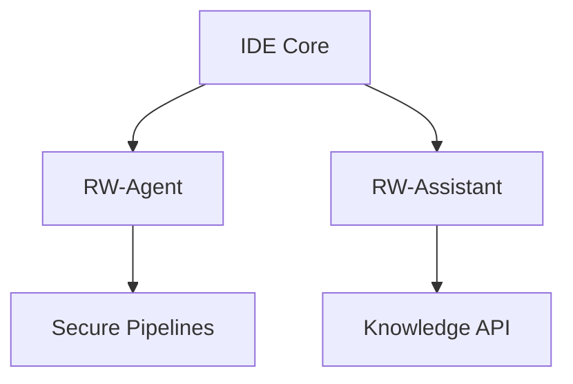

# RapidWebs Architecture Report

---

## Overview

The architecture of RapidWebs focuses on modularity, scalability, and security. Our platform is built to accommodate the needs of modern developers while ensuring seamless integration with existing workflows.

---

## Key Modules

1. **IDE Core (RapidForge):**
   - The user-facing interface providing project management, editing, and collaboration.
   - Extensible via plugins.

2. **RW-Agent:**
   - Orchestrates automation tasks and multi-agent workflows.
   - Integrated with secure communication channels.

3. **RW-Assistant:**
   - AI-driven conversational assistant for debugging, documentation, and coding.
   - Powered by advanced natural language processing models.

---

## Modular Relationships

---